# AI 워크스페이스 시스템 아키텍처 (Mermaid)

> **강의용 도식화 문서** - Mermaid 다이어그램 버전
>
> ! Obsidian, GitHub, Notion 등에서 렌더링됩니다.

---

## 1. 시스템 전체 구조

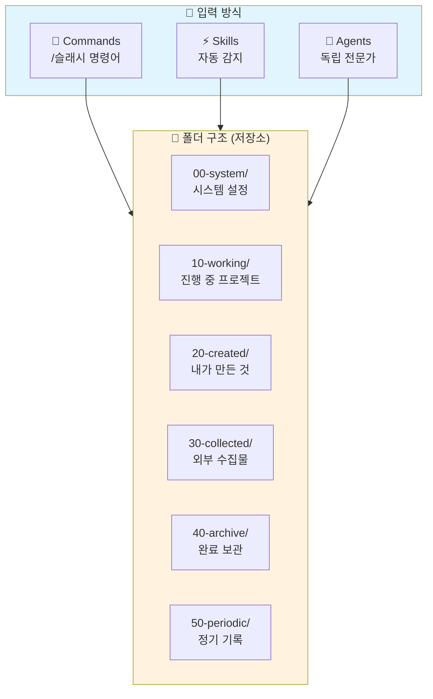

---

## 2. 확장 기능 3종 비교

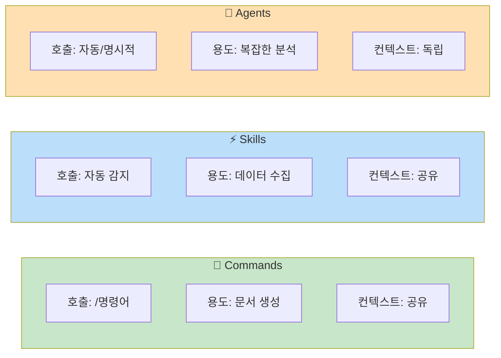

---

## 3. 분류 핵심 원칙

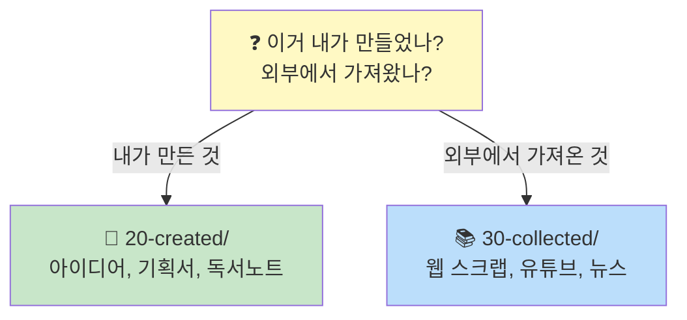

---

## 4. 폴더 구조 상세

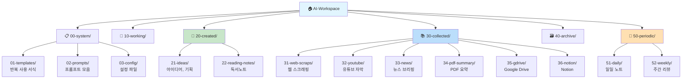

---

## 5. Commands → 폴더 매핑

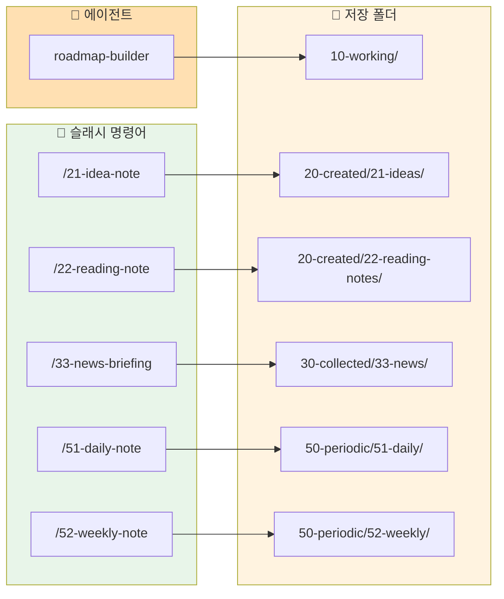

---

## 6. Skills 저장 경로 결정

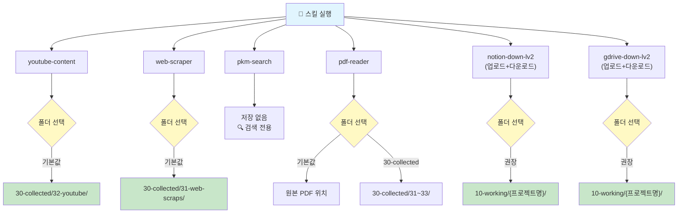

---

## 7. 일일 워크플로우

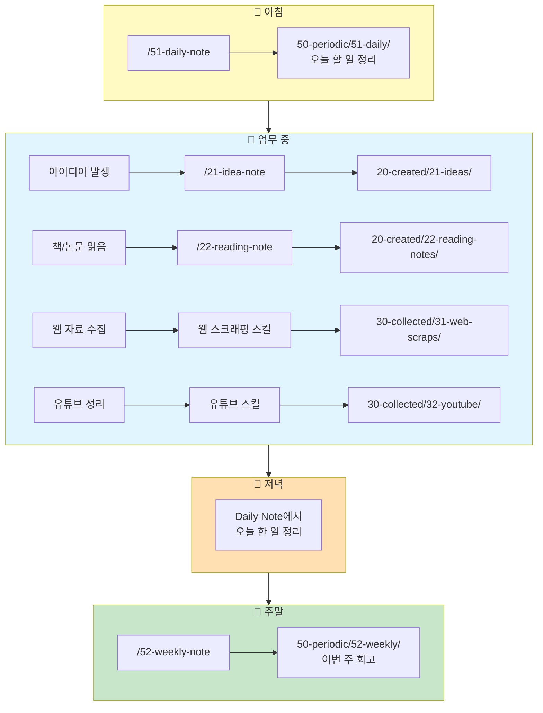

---

## 8. 설정 레벨 비교

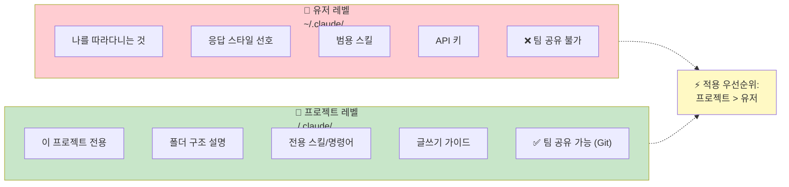

---

## 9. Johnny Decimal 번호 체계

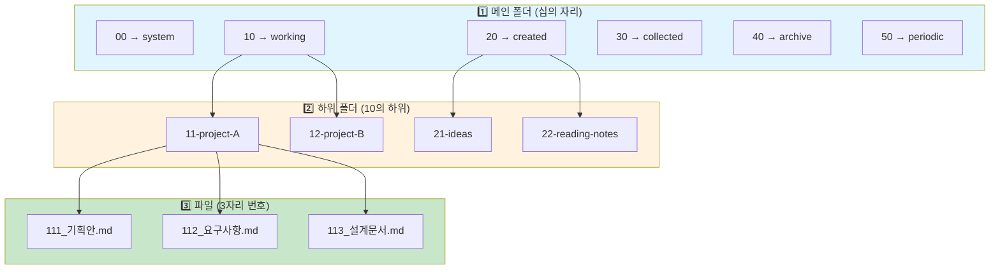

> **규칙**: 폴더 번호(11) × 10 + 순번 = 파일 번호 (111, 112, 113...)

---

## 10. 시스템 요약

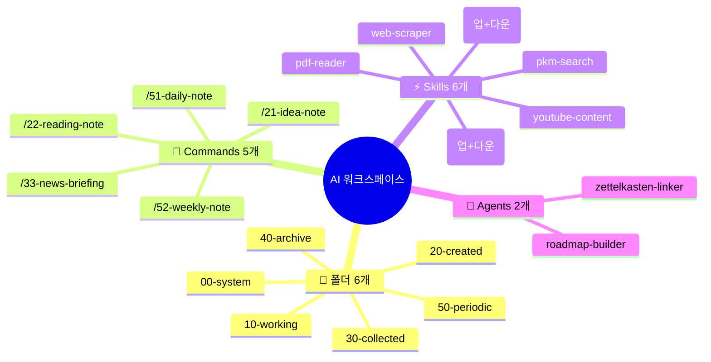

---

## 부록: 핵심 원칙 4가지

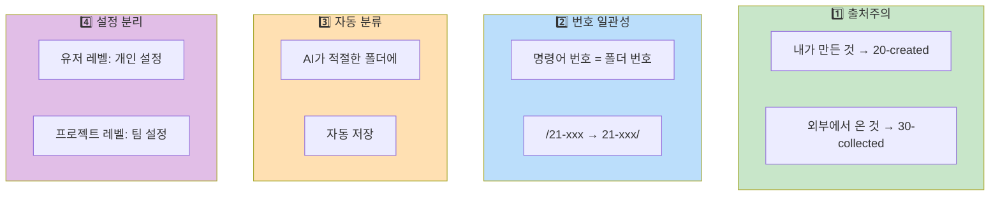

---

*GPTers 20기 AI 워크스페이스 스터디*
*Made with Claude Code*
*v1.1.1 | 2026-01-07*
